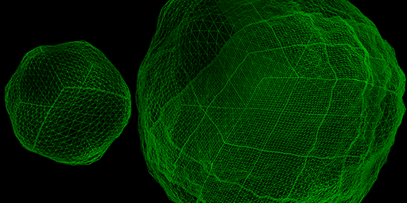

# Geogen

This is a part of [Node3D](https://github.com/node-3d) project.


> npm i -s geogen-raub

[Live DEMO](http://gsom.tech/geogen).


## Synopsis

Function `geogen()` is exported (as `module.exports` or `window.geogen`).
This is a planetary geometry generator. It generates a dynamic LOD chunked
sphere with vertices displaced according to the values of the `heightmap`.
The output is in form of raw number values, so it can be used with any
graphical library.




## Function `geogen()`

The idea is to generate a cube, and then normalize each of the vertices, resulting
in a spheric geometry. Regarding the LODs, the approach is to subdivide any chunk
into 4 equal pieces as soon as the LOD distance is reached.

As the geometry is indexed and each chunk has the same setup, the same index buffer
can be reused throughout all the chunks (being built only once).
The time required for generation of chunks is also reduced by that fact.

All the chunks have so called skirts. That is an additional geometry underneath
the surface, designed to hide any LODding seams. So the geometry is ready for use.

The texture coordinates are in planetary scale, [0; 1] for each side. However the
directions are a bit tricky, and probably require some experimenting and additional
docs. This snippet can probably help with texture generation, for now:

```
vec2 xy = varUv * (1024.0 + 1.0) - (512.0 + 0.5);
vec3 coords;
if (index == 0) {
	coords = vec3(1024.0, -xy.y, xy.x);
} else if (index == 1) {
	coords = vec3(-1024.0, -xy.y, -xy.x);
} else if (index == 2) {
	coords = vec3(xy.x, 1024.0, -xy.y);
} else if (index == 3) {
	coords = vec3(-xy.x, -1024.0, -xy.y);
} else if (index == 4) {
	coords = vec3(-xy.y, xy.x, 1024.0);
} else if (index == 5) {
	coords = vec3(-xy.y, -xy.x, -1024.0);
}
```

Here `index` is the side of the initial cube, as follows: [x, -x, y, -y, z, -z].


### Args:

```js
{
	radius: number = 500,
	height: number = 100 / 255,
	thresholds: [number] = [1300, 900, 700, 400, 200], // any length
	resolution: number = 16, // int
	heightmaps: [{
		resolution: number = 1,
		data: TypedArray = Uint8Array.from([0]),
		at: number = 0,
		step: number = 4,
	}], // 6 pieces
	onGeometry: GEOCALLBACK,
}
```

* `radius` - base size of the sphere.
* `height` - heightmap scale, here `/255` means normalising from `Uint8` [0; 255] range.
* `thresholds` - a set of LOD distances.
* `resolution` - the number of quads in a chunk (per side).
* `heightmaps` - 6 heightmaps for each side of the sphere.
* `onGeometry` - a callback to be called for each generated chunk, as described below.


### Returns:

```js
{
	update: () => {},
}
```

* `update` - has to be called in order to recalculate the LOD.
It can be called each frame or periodically.
However, the more often it is called the less changes
it has to manage, hence lower the latency.


## Function `GEOCALLBACK`:

This user function is responsible for interaction with the generator.
The generator would call it each time a new chunk is created.

The function receives all the generated buffers along with the side index and
the chunk center initial position. This initial position can be used to later
calculate the world-space chunk position required for LOD update.

The function is expected to return several callbacks, that will be called during
the LOD update. The LOD controller will need the actual information about the camera
position, the chunk position and the position of the whole planet. The LOD
controller will at some point decide to switch the visibility of a chunk ON or
OFF, and expects the respective callback to do so.

### Args:

```js
{
	indices: Uint16Array,
	vertices: Float32Array,
	normals: Float32Array,
	uvs: Float32Array,
	index: number, // 0 1 2 3 4 5 - cube-side index
	center: [number, number, number], // vec3
}
```

* `indices` - index buffer.
* `vertices` - vertex buffer.
* `normals` - normal buffer.
* `uvs` - texture coordinates buffer.
* `index` - the side of the initial cube, as follows: [x, -x, y, -y, z, -z].
* `center` - 3D position of the center of the chunk.

### Returns:

```js
{
	getChunkPos: () => [number, number, number],
	getPlanetPos: () => [number, number, number],
	getCameraPos: () => [number, number, number],
	setVisible: v => {},
}
```

* `getChunkPos` - get the current world position of the chunk.
* `getPlanetPos` - get the current world position of the planet.
* `getCameraPos` - get the current world position of the camera.
* `setVisible` - show/hide the chunk.

It is important to understand those are the functions you provide into the generator,
so it can do a good job. If those functions are setup incorrectly, it won't work
as expected.

Here is an example of such a set of callbacks:

```js
return {
	getChunkPos : () => {
		const v3 = anchor.getWorldPosition(new THREE.Vector3());
		return [v3.x, v3.y, v3.z];
	},
	getPlanetPos : () => {
		const v3 = planet.position;
		return [v3.x, v3.y, v3.z];
	},
	getCameraPos : () => {
		const v3 = camera.position;
		return [v3.x, v3.y, v3.z];
	},
	setVisible: v => {
		surface.visible = v;
	},
};
```

In this example:

* `anchor` - a THREE.Object3D earlier created at the `center` position.
* `planet` - a THREE.Object3D representing the whole planet.
* `camera` - a THREE.js camera.
* `surface` - a THREE.Object3D representing this chunk.

You don't have to nest chunk objects to enforce hierarchical invisibility.
Nor that you could guess their nesting by the plain geometry values.
The generator does that implicitly and takes care of it.

---

A working integration of this generator can be found on the
[Live DEMO](http://gsom.tech/geogen) website. The heightmap here is generated
with the help of [Texgen](https://github.com/node-3d/texgen-raub). The source
of the demo is not obfuscated in any way so it can also be used as a reference.
